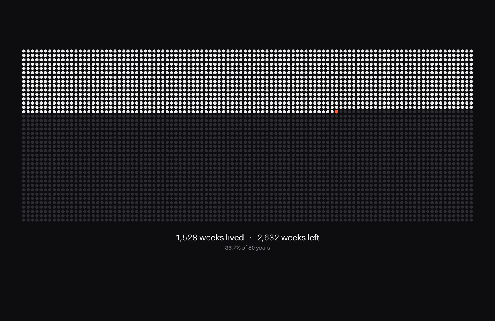

# LifeDots

A menu-bar app for macOS that sets your desktop wallpaper to a grid of dots. Each dot is one week of your life. Weeks already lived are filled. The current week is highlighted in orange. Weeks remaining are dimmed.



## Requirements

- macOS 13 (Ventura) or later
- Xcode or the Xcode Command Line Tools (`xcode-select --install`)

## Install

```bash
git clone https://github.com/Ayush3401/LifeDots.git
cd LifeDots
./build.sh --install
```

This builds the app on your Mac and installs it in `/Applications`, or in `~/Applications` if you don't have admin rights. Because the app is built locally, macOS doesn't show a Gatekeeper warning.

To update later, run `git pull && ./build.sh --install` in the same folder.

## Build only

Running `./build.sh` without `--install` builds `build/LifeDots.app` and does nothing else. On the first launch the Settings window opens. Enter your date of birth and click **Set Wallpaper**. Then choose **Launch at Login** from the menu-bar icon.

For a quick dev loop you can also run `swift run`. Launch at Login only works from the bundled `.app`.

## How it works

| File | Role |
|---|---|
| `LifeCalculator.swift` | Weeks lived and weeks left. Each year is 52 weeks counted from your birthday, so rows don't drift with leap years. |
| `WallpaperRenderer.swift` | Draws the PNG at each display's native pixel size. It picks the grid shape that gives the largest dots and avoids the menu bar, notch and Dock. |
| `WallpaperManager.swift` | Writes one PNG per display and applies it with `NSWorkspace.setDesktopImageURL`. |
| `AppDelegate.swift` | Menu-bar UI and the triggers that cause a redraw. |
| `SettingsWindowController.swift` | Settings window (plain AppKit, so it builds with just the Command Line Tools). |

The wallpaper is redrawn when:
- the Mac wakes,
- the day changes,
- the time zone or display setup changes,
- you edit a setting.

A 30-minute timer also checks for changes but only renders if the image would differ. Switching Spaces re-applies the current image, because macOS sets a wallpaper for one Space at a time.

Each render gets a new file name because macOS caches the desktop picture by path. Old renders are deleted from `~/Library/Application Support/LifeDots/Wallpapers`.

## Notes

- **Several Spaces:** a Space you haven't opened since the last update shows the new image as soon as you switch to it.
- **Uninstall:** turn off Launch at Login, quit the app, then delete `LifeDots.app` from `/Applications` or `~/Applications` and `~/Library/Application Support/LifeDots`.

## License

[MIT](LICENSE)
