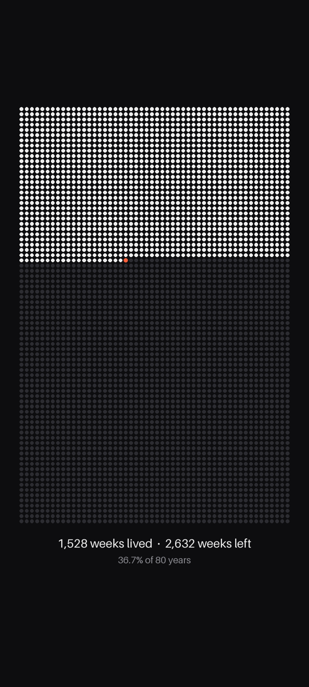

# LifeDots

Your wallpaper as a grid of dots, one for every week of your life. Weeks you've lived are filled in, the current week is orange, and the weeks you have left are dimmed. It updates by itself.

| macOS | Android |
|---|---|
|  |  |

## Apps

| Platform | How it works | Get it |
|---|---|---|
| **macOS** 13+ | Menu-bar app that sets the desktop picture on every display | [macos/](macos/README.md) |
| **Android** 8.1+ | Live wallpaper that redraws itself each time you look at it | [android/](android/README.md) |

Both apps count weeks the same way. Each year has 52 weeks, counted from your birthday, so every year starts a new row and leap years don't shift the grid.

## License

[MIT](LICENSE)
